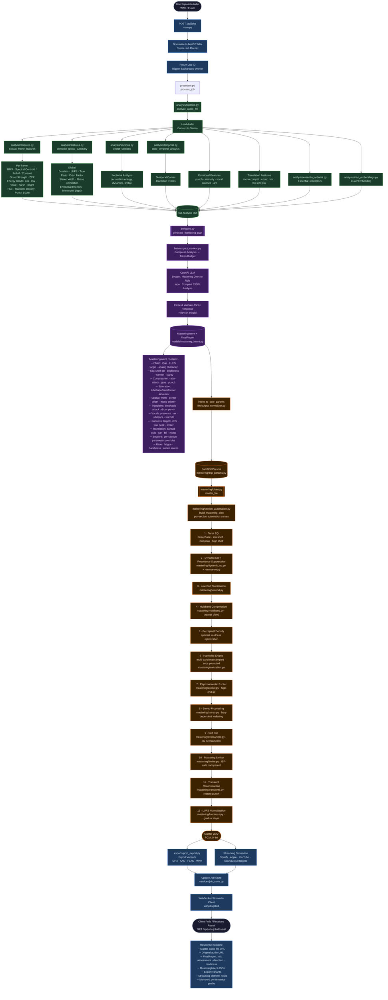

# AI Mastering Pipeline

```mermaid
flowchart TD
    A([User Uploads Audio\nWAV / FLAC]) --> B[POST /api/jobs\nmain.py]
    B --> B1[Normalize to float32 WAV\nCreate Job Record]
    B1 --> B2[Return Job ID\nTrigger Background Worker]

    B2 --> C[processor.py\nprocess_job]

    %% ── ANALYSIS ──────────────────────────────────────────
    C --> D[[analysis/pipeline.py\nanalyze_audio_file]]

    D --> D1[Load Audio\nConvert to Stereo]
    D1 --> D2[analysis/features.py\nextract_frame_features]
    D2 --> D2a["Per-frame:\nRMS · Spectral Centroid / Rolloff / Contrast\nOnset Strength · ZCR\nEnergy Bands: sub · low · vocal · harsh · bright\nFlux · Transient Density · Punch Score"]

    D1 --> D3[analysis/features.py\ncompute_global_summary]
    D3 --> D3a["Global:\nDuration · LUFS · True Peak · Crest Factor\nStereo Width · Phase Correlation\nEmotional Intensity · Immersion Depth"]

    D1 --> D4[analysis/sections.py\ndetect_sections]
    D4 --> D4a[Sectional Analysis\nper-section energy, dynamics, timbre]

    D1 --> D5[analysis/temporal.py\nbuild_temporal_analysis]
    D5 --> D5a[Temporal Curves\nTransition Events]

    D1 --> D6[Emotional Features\npunch · intensity · vocal salience · arc]
    D1 --> D7[Translation Features\nmono compat · codec risk · low-end risk]
    D1 --> D8[analysis/essentia_optional.py\nEssentia Descriptors]
    D1 --> D9[analysis/clap_embeddings.py\nCLAP Embedding]

    D2a & D3a & D4a & D5a & D6 & D7 & D8 & D9 --> D_OUT[(Full Analysis Dict)]

    %% ── LLM ───────────────────────────────────────────────
    D_OUT --> E[[llm/intent.py\ngenerate_mastering_plan]]

    E --> E1[llm/compact_context.py\nCompress Analysis → Token Budget]
    E1 --> E2[OpenAI LLM\nSystem: Mastering Director Role\nInput: Compact JSON Analysis]
    E2 --> E3[Parse & Validate JSON Response\nRetry on Invalid]
    E3 --> E_OUT[(MasteringIntent + FinalReport\nmodels/mastering_intent.py)]

    E_OUT --> E_detail["MasteringIntent contains:\n─ Chain: style · LUFS target · analog character\n─ EQ: shelf dB · brightness · warmth · clarity\n─ Compression: ratio · attack · glue · punch\n─ Saturation: tube/tape/transformer amounts\n─ Spatial: width · center · depth · mono priority\n─ Transients: emphasis · attack · drum punch\n─ Vocals: presence · air · sibilance · warmth\n─ Loudness: target LUFS · true peak · limiter\n─ Translation: earbud · club · car · BT · mono\n─ Sections: per-section parameter overrides\n─ Risks: fatigue · harshness · codec scores"]

    %% ── DSP SAFETY MAPPING ────────────────────────────────
    E_OUT --> F[intent_to_safe_params\nllm/output_normalizer.py]
    F --> F_OUT[(SafeDSPParams\nmastering/dsp_params.py)]

    %% ── MASTERING CHAIN ───────────────────────────────────
    F_OUT --> G[[mastering/chain.py\nmaster_file]]

    G --> G0[mastering/section_automation.py\nbuild_mastering_plan\nper-section automation curves]

    G0 --> G1[1 · Tonal EQ\nzero-phase · low shelf · mid peak · high shelf]
    G1 --> G2[2 · Dynamic EQ + Resonance Suppression\nmastering/dynamic_eq.py + resonance.py]
    G2 --> G3[3 · Low-End Stabilization\nmastering/lowend.py]
    G3 --> G4[4 · Multiband Compression\nmastering/multiband.py · dry/wet blend]
    G4 --> G5[5 · Perceptual Density\nspectral loudness optimization]
    G5 --> G6[6 · Harmonic Engine\nmulti-band oversampled · subs protected\nmastering/saturation.py]
    G6 --> G7[7 · Psychoacoustic Exciter\nmastering/exciter.py · high-end air]
    G7 --> G8[8 · Stereo Processing\nmastering/stereo.py · freq-dependent widening]
    G8 --> G9[9 · Soft Clip\nmastering/oversample.py · 8x oversampled]
    G9 --> G10[10 · Mastering Limiter\nmastering/limiter.py · ISP-safe transparent]
    G10 --> G11[11 · Transient Reconstruction\nmastering/transients.py · restore punch]
    G11 --> G12[12 · LUFS Normalization\nmastering/loudness.py · gradual steps]
    G12 --> G_OUT([Master WAV\nPCM 24-bit])

    %% ── POST-PROCESSING ───────────────────────────────────
    G_OUT --> H1[exports/pcm_export.py\nExport Variants\nMP3 · AAC · FLAC · WAV]
    G_OUT --> H2[Streaming Simulation\nSpotify · Apple · YouTube · SoundCloud targets]

    H1 & H2 --> I[Update Job Store\nservices/job_store.py]
    I --> J[WebSocket Stream to Client\nws/jobs/jobId]

    %% ── CLIENT RETRIEVAL ──────────────────────────────────
    J --> K([Client Polls / Receives Result\nGET /api/jobs/jobId/result])
    K --> L["Response includes:\n─ Master audio file URL\n─ Original audio URL\n─ FinalReport: mix assessment · direction · readiness\n─ MasteringIntent JSON\n─ Export variants\n─ Streaming platform notes\n─ Memory / performance profile"]

    %% ── STYLING ───────────────────────────────────────────
    classDef api fill:#1e3a5f,stroke:#4a9eff,color:#e0f0ff
    classDef analysis fill:#1a3d2b,stroke:#4caf50,color:#d0f0dc
    classDef llm fill:#3d1f5f,stroke:#a855f7,color:#edd5ff
    classDef dsp fill:#3d2200,stroke:#f97316,color:#ffe8cc
    classDef io fill:#1a1a2e,stroke:#94a3b8,color:#e2e8f0
    classDef detail fill:#111,stroke:#555,color:#aaa,font-size:11px

    class A,K io
    class B,B1,B2,I,J,L api
    class D,D1,D2,D2a,D3,D3a,D4,D4a,D5,D5a,D6,D7,D8,D9,D_OUT analysis
    class E,E1,E2,E3,E_OUT,E_detail llm
    class F,F_OUT,G,G0,G1,G2,G3,G4,G5,G6,G7,G8,G9,G10,G11,G12,G_OUT dsp
    class H1,H2 api
```
